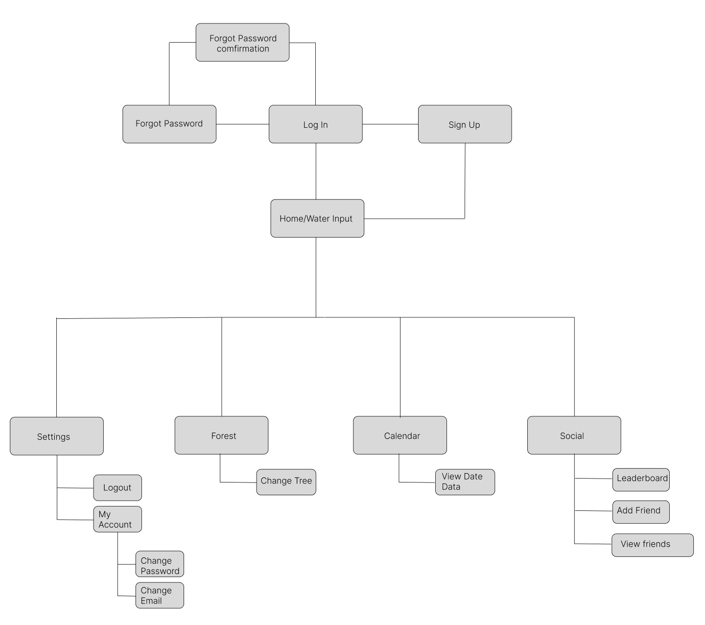
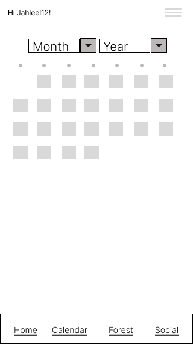
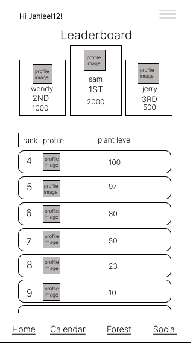

# UX Design Documentation

## Prototype Link

[Figma Prototype](https://www.figma.com/proto/9uGmtnCArbxgwMMX8CGeq3/HydroForest?node-id=5-265&p=f&t=LQ4XWFUNy0XtHjmP-1&scaling=min-zoom&content-scaling=fixed&page-id=0%3A1&starting-point-node-id=5%3A72&show-proto-sidebar=1)

[Figma App Map](https://www.figma.com/design/9uGmtnCArbxgwMMX8CGeq3/HydroForest?node-id=6-2&p=f&t=JjE2Z645F88uRBlf-0)

## App Overview

This document outlines the UX design for our application. Below, you will find an **app map** followed by detailed wireframes representing different screens of the app.

## App Map

Below is a structured representation of the app's navigation flow:

- **Login & Registration**

  - Login Page
  - Registration Page
  - Forgot Password
  - Password Reset Confirmation

- **Main Features**

  - Home Page (Log water intake)
  - Forest (Main Tracking Screen)
  - Calendar (Checking past data)
  - Social (Friends & Leaderboard)

- **User Settings**

  - My Account
  - Change Password
  - Change Email

- **Additional Features**
  - Help Guide
  - Messages
  - Hamburger Menu (Navigation Sidebar)

## Wireframe Screens

### 1. Login Page

**Purpose:** Users can log in to existing accounts, reset their password, or make an account.

### 2. Registration Page

**Purpose:** Enables new users to create an account by providing their details, including first name, last name, email, username, and password. If they need help, there is a link to a help guide.

### 3. Forgot Password

**Purpose:** Helps users reset their password by entering their username and email address. A reset link is sent to their email.

### 4. Password Reset Confirmation

**Purpose:** Displays a confirmation message after a user requests a password reset.

### 5. Home Page

**Purpose:** The main screen where users track their hydration progress and interact with their virtual tree.

### 6. Forest Page

**Purpose:** Displays a visual representation of the user's progress with their tree. There is a “Change Tree” button that changes the image of the tree according to user preferences.

### 7. Calendar

**Purpose:** Provides an overview of the user's hydration habits over time, showing past water intake records.

### 8. Social Page

**Purpose:** Allows users to add friends, view their friends' activity, and access the leaderboard.

### 9. Leaderboard

**Purpose:** Displays rankings based on user hydration progress, fostering friendly competition.

### 10. My Account

**Purpose:** Shows user profile information, including current streaks, total water intake, and account settings.

### 11. Change Password

**Purpose:** Allows users to update their password by entering their current and new passwords.

### 12. Change Email

**Purpose:** Enables users to update their email address. A verification process ensures security.

### 13. Help Guide

**Purpose:** Provides an overview of how the app works and how users can benefit from it.

### 14. Messages

**Purpose:** Displays messages and notifications related to the app's functionality.

### 15. Hamburger Menu

**Purpose:** Offers quick access to different app sections, including My Account, Privacy Policy, and Logout.

-2.png>)

## Conclusion

This document serves as a reference for understanding the application's user experience and navigation. The wireframes above illustrate the essential screens, ensuring a seamless and intuitive user journey.
